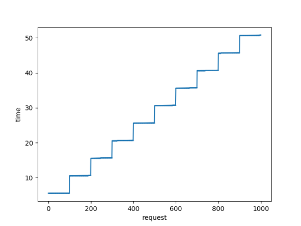

# Training Week 1
- Basic Web Development
- Setup
- Basic API Development

# Training Week 2
- Code Quality
- HTTP Status & Error Handling
- Testing
- API Documentation
- Docker experience and setting up Database

# Training Week 3
- Higher-Order Function and Decorator
- Registration and Mailer
- Authentication with JWT

--

## Setup

##### Backend
1. Clone the project & `cd` into it

2. Install depedencies
``` shell
$ pipenv install
```

3. Run app
``` shell
$ pipenv run app
```

 Note: on production, run `STAGE=production pipenv run app`, or staging using same format with different STAGE

4. Run test

``` shell
pipenv run test
```

## Tasks

- [x] Writing simple `Stateful Backend` that has APIs to support multiple methods `GET, PUT, POST, DELETE`
```
1. Declare a `global` dict namely RESULT
2. Write a GET api with query-param as one of RESULT's keys to return its corresponding value in plain text-format
3. Write a PUT api to add more key to RESULT with default value being an empty string
4. Write a POST api to add more than one keys and values to the RESULT dict
5. Write a DELETE api to delete a single key of RESULT dict
6. Write a PATCH api to update a specific key of RESULT dict
```


- [x] Writing Error Handler and learning to handle different types of exception in different scenarios

```
1. Write BadRequest Handler
2. Write a Generic Exception Handler
3. Raise Exception instead of returning simple strings
4. Write Test (so I can save time running the development server and sending stupid requests)
5. Document API with text-based REST-Client
```

- [ ] Registration & Authentication Strategy

```
1. Re-design User Schema
2. Write Public API for User Registration
3. Send email to newly registered user for Activation Request
4. Write Public API for User Login, authenticated using JWT
```

# Experiment
## Purpose
To address the problem: "Execute several tasks at the same time?"

Through concurrency, we can achieve this and our Python programs will be able to handle even more requests at a single time, and over time leading to impressive performance gains.
## Theoretical Basis

### Concurrency, Parallelism and Asynchronous
**Concurrent** and **Parallel** are effectively the same principle, both are related to tasks being executed simultaneously although parallel tasks should be truly multitasking, executed "at the same time" whereas concurrent could mean that the tasks are sharing the execution thread while still appearing to be executing in parallel.


**Asynchronous** methods aren't directly related to the previous two concepts, asynchrony is used to present the impression of concurrent or parallel tasking but effectively an asynchronous method call is normally used for a process that needs to do work away from the current application and we don't want to wait and block our application awaiting the response.

For example, getting data from a database could take time but we don't want to block our UI waiting for the data. The async call takes a call-back reference and returns execution back to your code as soon as the request has been placed with the remote system. Your UI can continue to respond to the user while the remote system does whatever processing is required, once it returns the data to your call-back method then that method can update the UI (or handoff that update) as appropriate.

### Asynchrony
Asynchrony, in computer programming, refers to the occurrence of events independent of the main program flow and ways to deal with such events. These may be "outside" events such as the arrival of signals, or actions instigated by a program that take place concurrently with program execution, without the program blocking to wait for results. Asynchronous input/output is an example of the latter cause of asynchrony, and lets programs issue commands to storage or network devices that service these requests while the processor continues executing the program. Doing so provides a degree of parallelism.

A common way for dealing with asynchrony in a programming interface is to provide subroutines (methods, functions) that return to their caller an object, sometimes called a future or promise, that represents the ongoing events. Such an object will then typically come with a synchronizing operation that blocks until the operation is completed.

## Preparing
We could use an another computer or a virtual machine (PC2) to make requests to PC1 where the app located.

### gunicorn

Gunicorn takes care of everything which happens in-between the web server and your web application. This way, when coding up your a Django application you don’t need to find your own solutions for:

- communicating with multiple web servers
- reacting to lots of web requests at once and distributing the load
- keeping multiple processes of the web application running

```console
pipenv run gunicorn --worker-class=gevent --worker-connections=1000 --workers=9 --bind=192.168.0.103:5000  app:app

```
## Process

To conduct this experiment by the following way:
- Send 1000 request from PC1 to PC2 (where the app located) using the script at PC2:
```python
import asyncio
import time
import aiohttp
import matplotlib.pyplot as plt

begin = time.time()
end_times = []
waiting_after_10s = 0

async def fetch(session, url, task_name):
    global begin
    global end_times
    global waiting_after_10s

    async with session.get(url) as response:
        await response.json()
        if time.time() - begin > 10:
            print("Over 10s")
            waiting_after_10s += 1
        end_times.append(time.time() - begin)


async def main(num):
    global begin
    my_url = 'http://192.168.0.103:5000/api/user/1'
    my_session = aiohttp.ClientSession()
    tasks = [fetch(my_session, my_url, 'task {}'.format(i+1)) for i in range(num)]
    for task in await asyncio.gather(*tasks):
        pass

    requests = [i for i in range (num)]

    fig = plt.figure()
    plt.plot(requests, end_times, marker="o", markersize=0.4)
    plt.xlabel("request")
    plt.ylabel("time")
    fig.savefig('async.png')
    
    global waiting_after_10s
    print(waiting_after_10s)

asyncio.run(main(1000))

```
- So we need import :
    - aiohttp: to create a session for a client to make requests and responses become coroutines
    - asyncio: to help manipulate coroutines, the coroutines are automatically scheduled to run soon with `asyncio.create_task() `
    - matplotlib: to plot (requests, time)

For the link `http://192.168.0.103:5000/api/user/1`
```python
@bp.route('/api/user/<int:id>', methods=['GET'])
def get_by_id(id):
    user = load_user(id)
    time.sleep(5)
    return jsonify(user=user.serialize)
```
We can see that it takes more than 5s to complete a single request.

## Result



As we can see that a bunch of request was handle at the same time. And at the first `10s` we had `100/1000 `resolved request. And the final request end at about `50s` instead of `1000 * 5 = 5000s` compare to sync requests.
## Conclusion
From the examples above, we can see how concurrency helps our code run faster than it would in a synchronous manner. As a rule of thumb, Multiprocessing is best suited for CPU-bound tasks while Multithreading is best for I/O-bound tasks.
## Future Improvments

